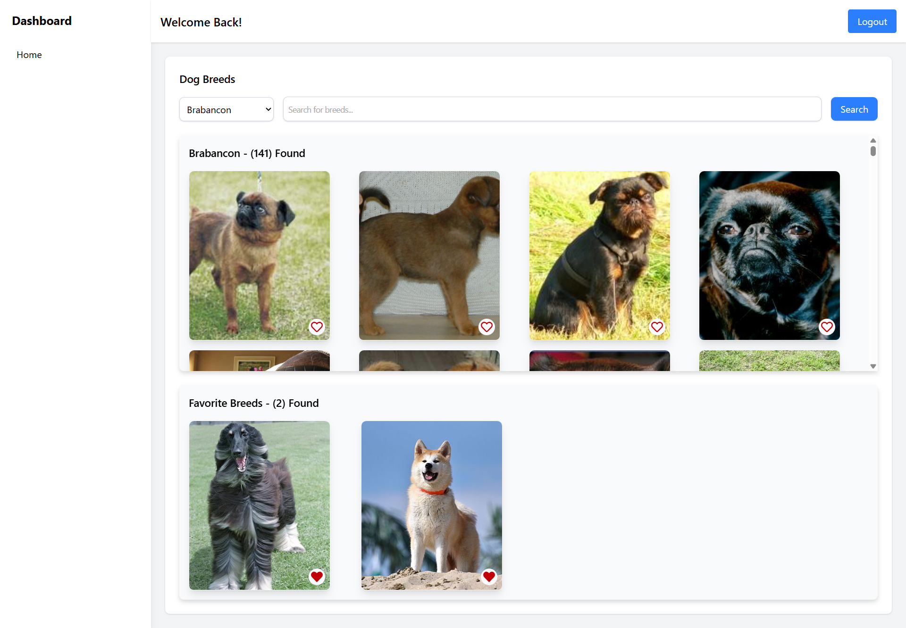

# Dog Breed App Challenge

This exercise is a bare-bones version of a dog breed app, where we ask candidates to build out a small application. The goal: give both the candidate and the FAST AI Movies team a chance to interact on a realistic, but limited (shooting for just a few hours), task. We see this as a two-way evaluation for the team and the candidate to decide if it's a good fit.

## 🛠 Tech Stack

- React (with TypeScript)
- Vite
- React Context API (for state management)
- Vitest (for testing)

## 🚀 Getting Started

### 1️⃣ Clone the Repository

git clone https://github.com/Philipp-FastAIMovies/DogBreedApp_Challenge.git

### 2️⃣ Install Dependencies

npm install

### 3️⃣ Start the Development Server

npm run dev

The app will be running at `http://localhost:5173/`.

## 🌐 The Dog API

This is the API that should be used: https://dog.ceo/dog-api/documentation/breed
Especially important are
- List all breeds
- By breed

## 💻 Sample Visualization

This is what a very simple version of the app could look like:

## 📂 Project Structure

Your goal is to build an extensible and maintainable project structure following best practices.

DogBreed Folder Structure
├── src
│   ├── assets        # Static assets like images, icons, and styles
│   ├── components    # Reusable UI components (buttons, cards, modals, etc.)
│   ├── context       # React Context API for state management
│   ├── hooks         # Custom React hooks for fetching and managing state
│   ├── layout        # Layout components like headers, footers, and wrappers
│   ├── services      # API service functions (e.g., fetching breed images)
│   ├── tests         # Unit and integration test files

## 🧪 Running Tests

To run tests using **Vitest**, use the following command:

npm run test

## 📌 Notes

- Ensure you have **Node.js** installed (recommended: version 18+).
- If using **pnpm** or **yarn**, replace `npm` with `pnpm` or `yarn` in commands.